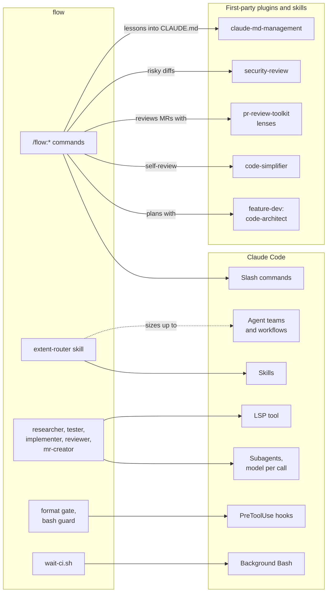
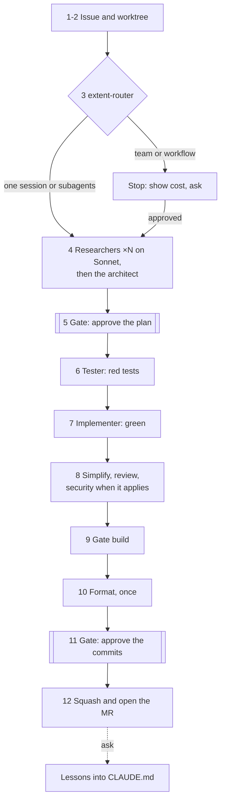
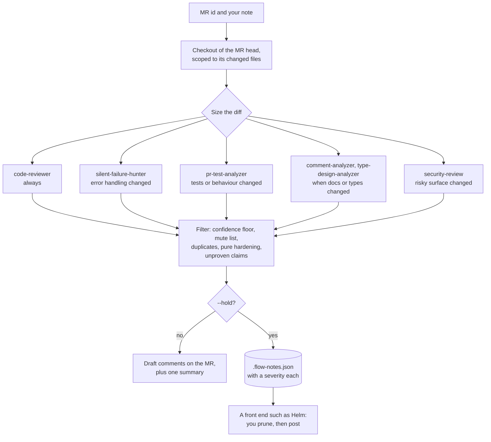
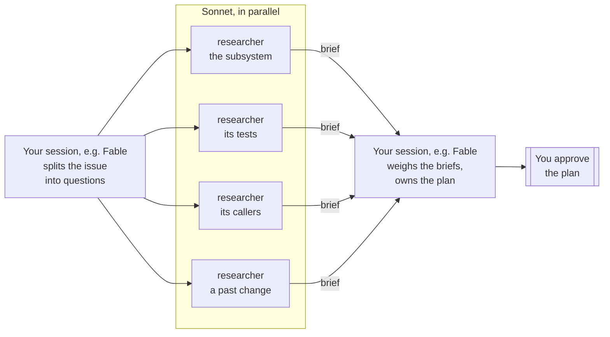

# flow

A Claude Code plugin that takes an issue to a merge request, and reviews other people's. Each issue
gets its own git worktree and a chain of agents (plan, red tests, implementation, fresh-context
review, build, format), with exactly two stops for you: approve the plan, approve the commits.
Reviews of other people's MRs post line-anchored **draft** comments that you prune and submit
yourself. Nothing in it is tied to a language, build system or forge: project conventions come from
your `CLAUDE.md`, and commands and preferences from one config file. GitLab (`glab`) and GitHub
(`gh`) are both supported.

- [Quick start](#quick-start)
- [How it is built](#how-it-is-built), and [the Claude Code features it uses](#claude-code-features-flow-uses)
- [The issue pipeline](#the-issue-pipeline) and [reviewing other people's MRs](#reviewing-other-peoples-mrs)
- [Cheap reading, careful thinking](#cheap-reading-careful-thinking) and [what it costs](#what-it-costs)
- [Configuration](#configuration), [recovering](#recovering), [testing the plugin](#testing-the-plugin)

## Quick start

```
git clone https://github.com/MarkusVGJensen/flow ~/.claude/skills/flow
cp ~/.claude/skills/flow/flow.config.example.json ~/.claude/flow.local.json
```

Fill in the config (the two kinds differ only in the first lines), install the
[companion plugins](#install), then in a Claude Code session in your checkout:
`/flow:start-issue 128`.

<table>
<tr><th>GitLab</th><th>GitHub</th></tr>
<tr><td>

```json
{
  "forge": "glab",
  "project": "group/repo",
  "defaultTarget": "main",
  "worktreeRoot": "~/worktrees",
  "branchPattern": "you/{issue}-{slug}"
}
```

</td><td>

```json
{
  "forge": "gh",
  "project": "owner/repo",
  "defaultTarget": "main",
  "worktreeRoot": "~/worktrees",
  "branchPattern": "you/{issue}-{slug}"
}
```

</td></tr>
</table>

## How it is built

flow adds no runtime of its own. Every part is a standard Claude Code primitive, and where a
first-party plugin or built-in skill already does a job well, flow calls it instead of reimplementing
it. The one script it ships waits on CI so that the model does not have to.



### Claude Code features flow uses

| Feature | Where flow uses it |
| --- | --- |
| Slash commands | The seven `/flow:*` entry points below |
| Skills | `extent-router`, invoked at step 3 and picked up by Claude on its own; built-in `security-review`; `claude-md-management:revise-claude-md` |
| Subagents | Five of its own, plus `code-architect`, `code-simplifier` and the `pr-review-toolkit` lenses, each with a tool list cut to its job |
| Model per call | `models` in the config picks the model for each kind of agent, overriding the agent file |
| Parallel fan-out | Researchers in planning, review lenses in `review-mr` |
| `LSP` tool | Researcher, tester, implementer and reviewer look symbols up through the language server when one is installed |
| Hooks | `PreToolUse` on Bash: the format gate and the bash guard |
| Background Bash | `wait-ci.sh` waits on CI while the model is idle |
| Agent teams, workflows | The top two rungs of `extent-router`, used only after you approve the cost |
| Plugin evals | `evals/` pins the behaviour that matters; see [testing](#testing-the-plugin) |

## Commands

| Command | What it does |
| --- | --- |
| `/flow:start-issue <id>` | Worktree, plan, red tests, implementation, self-review, gate build, format, pushed commits, MR |
| `/flow:status` | Where this worktree stands: step, gate, branch, MR, pipeline |
| `/flow:review-queue` | The MRs waiting on your review; pick one to start it |
| `/flow:review-mr <id> [--hold]` | Fans out review lenses, filters hard, posts draft comments. `--hold` keeps them in `.flow-notes.json` instead, with a severity each, for a front end to show and post |
| `/flow:resolve-comments <id>` | Sorts the feedback on your MR, fixes what is real, lands one commit |
| `/flow:watch-pipeline [id]` | Waits on CI without spending tokens, fixes real failures, retries known flakes, within hard limits |
| `/flow:vs <file>[:line]` | Optional, for Visual Studio users: opens the file at a line |

## The issue pipeline

`/flow:start-issue` runs twelve numbered steps. Only the two gates wait for you; everything between
them runs uninterrupted.



- **Plan.** Cheap `researcher` agents read the areas the issue touches in parallel; `code-architect`
  turns their briefs into `.flow-plan.md`: the issue, the fix, Mermaid UML, the files, the test list,
  mockups when there is a UI, and what done means. See
  [Cheap reading, careful thinking](#cheap-reading-careful-thinking).
- **Self-review.** Three passes on the diff: `code-simplifier` on the production files (tests re-run
  after it), `flow:reviewer` in fresh context, and the built-in `security-review` skill when the diff
  touches input, auth, paths, shell or SQL built from data, deserialization, secrets or networking.
- **Commits.** Before the second gate the branch is shaped into commits that read one at a time and
  pushed, so you can go through them before the MR exists. The MR step then squashes.
- **Lessons.** Once the MR is open, flow offers to fold what the issue taught (a convention the
  reviewer enforced, a build quirk) into `CLAUDE.md` through `claude-md-management`. Only on a yes,
  and you see the change first. `"learn": "off"` turns the offer off.
- **Progress.** Each step is written to `.flow-state.json` in the worktree as it starts (`active`),
  finishes (`done`), is skipped (`skipped`) or stops at a gate (`waiting`). A session that dies or is
  compacted resumes from it, and `/flow:status` and front ends read it.

## Reviewing other people's MRs

`/flow:review-mr` sizes the review to the diff, runs the lenses in parallel, and throws away most of
what they find before you see any of it.



A one-file fix gets `code-reviewer` alone; the table in the command is a ceiling, not a default, and
your note outranks it ("focus on the threading" runs only the lenses that bear on threading). Nothing
is ever submitted: drafts stay yours until you submit the review.

## Cheap reading, careful thinking

Planning is shaped like a sandwich: the strong model at both ends, the cheap model in the middle.
Your own session, on whatever model you run Claude Code with (Fable, for example), decides what needs
reading and turns it into one question per area. Several `researcher` agents on Sonnet read in
parallel and each answers with a short factual brief. The briefs go back up to the strong model, which
weighs them and owns the plan you are shown.



Fable, then Sonnets, then Fable: the expensive model asks and decides, the cheap one does the reading
in between.

- **Cost.** The bulk reading runs on the cheaper model, and only the briefs reach the agents that
  decide. A brief is a page where the files behind it are thousands of lines.
- **Context.** The session that runs the chain sees the findings, not the raw files, so its context
  stays small and focused for the rest of the issue.
- **Time.** Four researchers reading at once finish in roughly the time of one.
- **Precision.** With a language server installed, the researchers answer "who calls this" through
  the `LSP` tool in one call instead of a grep sweep across the tree.

Inside the second half, your session has `feature-dev`'s `code-architect` draft the plan document
from the issue and the briefs and reads that draft before it reaches you. How many researchers run is
the extent-router's call: a one-file fix gets none, and the session reads the code itself.

Every tier is a setting. `models` in the config names the model for the researchers, the architect,
the builders (tester and implementer), the reviewers, the review lenses and the MR creator, and is
passed on each call, so trading cost for depth is a config change rather than an edit to the agents.

## What it costs

Where the tokens of one issue go, cheapest first. The model column is the default; `models` changes
it.

| Step | Who | Model | What drives the cost |
| --- | --- | --- | --- |
| 1-3 Issue, worktree, extent | your session | yours | The issue and its comments |
| 4 Research | `researcher` ×0-N | Sonnet | Reading: most of the planning tokens, on the cheap model |
| 4 Plan | `code-architect`, your session | plugin's, yours | The briefs, not the files |
| 6-7 Tests, implementation | `tester`, `implementer` | Opus | Edits and test runs; `verify.syntaxCheck` keeps the loop cheap |
| 8 Self-review | `code-simplifier`, `reviewer`, `security-review` | plugin's, Opus, yours | One read of the diff each; security only on risky diffs |
| 9-10 Build, format | your session | yours | Command output, once each |
| 11-12 Commits, MR | your session, `mr-creator` | yours, Opus | Small |
| CI | `wait-ci.sh` | none | Nothing while CI runs: the script waits, the model does not |
| Team or workflow | many | per agent | Only after you approve the estimate `extent-router` shows |

## Agents

| Agent | Model | Tools | Job |
| --- | --- | --- | --- |
| `researcher` | Sonnet | read, LSP | Reads one area and returns a factual brief. Launched several at once |
| `tester` | Opus | edit, LSP | Writes the planned tests and makes sure they fail for the right reason. Never production code |
| `implementer` | Opus | edit, LSP | Makes the red tests pass inside the plan's files. Never edits a test |
| `reviewer` | Opus | read, LSP | Reviews the diff in fresh context against `CLAUDE.md`. Reports, never edits |
| `mr-creator` | Opus | git only | Squashes, pushes with lease, opens the MR from your template |

## Hooks

Two `PreToolUse` hooks on Bash:

- **Format gate** blocks `git commit` when source files changed after the formatter last ran. The
  format step stamps `$(git rev-parse --git-dir)/flow-formatted`.
- **Bash guard** blocks `git push --force` without a lease and, when `verify.formatGuard` names the
  project's tree-wide formatter, a run of it not acknowledged with `FLOW_TREEWIDE_OK=1`.

## Watching CI without spending tokens

`/flow:watch-pipeline` does not poll from the model. It starts `scripts/wait-ci.sh` in the
background, which asks `glab` or `gh` every `ci.pollMinutes`, prints a line when the status changes,
and exits when CI has finished. The session only wakes for a result: green, a failure to triage, or a
25-minute mark to start the waiter again. A failure gets a backup tag, a fix verified locally where
the platform allows, and a push with lease, within `ci.attempts`.

## The extent-router skill

`extent-router` picks the smallest arrangement that can do a job: one session, subagents, an agent
team, or a dynamic workflow. Each rung up multiplies token cost. `/flow:start-issue` invokes it at
step 3, and nothing else in flow does; Claude may also pick it up on its own when a task looks like
it needs parallel agents. At one session or subagents it proceeds silently. At a team or a workflow
it stops, says what it would run and roughly what it costs, and waits for you.

## Configuration

flow reads `.claude/flow.json` in the repository (shared with the team) and falls back to
`~/.claude/flow.local.json` (personal, never committed). Copy
[`flow.config.example.json`](flow.config.example.json) to either and fill it in. Without either file,
`/flow:start-issue` stops and says so; it never guesses a project or a command.

| Key | Meaning |
| --- | --- |
| `forge` | `glab` or `gh` |
| `project`, `defaultTarget` | The repository path and the branch MRs target |
| `worktreeRoot`, `branchPattern` | Where worktrees go, and branch names such as `you/{issue}-{slug}` |
| `verify.syntaxCheck`, `verify.targeted` | The cheap inner loop: seconds per edit, one test target |
| `verify.gate` | Every full build that must pass before the commits gate |
| `verify.format` | The formatter, run once at the end |
| `verify.extra` | Further checks after formatting, each with its condition after a `#` |
| `verify.formatGuard` | Regex for a tree-wide formatter the bash guard should hold back |
| `review.floor`, `review.mute` | Confidence floor for findings, and topics never to comment on |
| `models.research`, `.architect`, `.build`, `.review`, `.lenses`, `.mr` | The model for each kind of agent, passed per call; null keeps the agent's own |
| `learn` | `"ask"` (default) offers to fold lessons into `CLAUDE.md` after the MR; `"off"` never does |
| `mr.template` | Markdown file for the MR description; unset gives Summary / How to test / Notes |
| `mr.assignee` | `"me"` (default) or `null` |
| `mr.reviewers` | `null` adds none (default), `"none"` also strips project defaults, or a list of usernames |
| `ci.*` | Poll interval, stall limit, attempts, jobs that cannot be verified locally, known flaky tests |

An MR template is plain Markdown. `{issue}` becomes the issue number, `<…>` slots are written by
the agent, and an HTML comment holds instructions for the agent that are left out of the MR.

## Recovering

- **A session died, was compacted, or you came back tomorrow.** Run `/flow:start-issue <id>` again in
  a session in the checkout. It finds the worktree's `.flow-state.json` and resumes: finished and
  skipped steps are not redone, an `active` step is finished, a waiting gate shows you the plan or
  the commits again.
- **Where am I?** `/flow:status`.
- **The format gate blocked a commit.** Files changed after the formatter ran. Run `verify.format`
  again, then `touch "$(git rev-parse --git-dir)/flow-formatted"`; it is the last step on purpose.
- **A CI fix went wrong.** Every rewrite is preceded by a `backup/<branch>-<stamp>` tag. Reset to it
  and push with `--force-with-lease`.
- **The plan is wrong after the gate.** Say so. The architect re-plans and rewrites `.flow-plan.md`;
  a plan nobody believes is not patched.

## Testing the plugin

`evals/` holds [plugin evals](https://code.claude.com/docs/en/plugin-evals): small cases that run
in a clean sandbox with and without flow loaded, so each shows what flow changes.

| Case | Pins down |
| --- | --- |
| `extent-router-small` | A one-line fix stays one session and the skill fires |
| `extent-router-large` | A many-package migration stops and states agents and cost before spending |
| `start-issue-needs-config` | No config: it names the file to create and invents nothing |

```
claude plugin eval . --runs 3 --max-cost-usd 5
```

Add a case whenever a command's behaviour is changed on purpose, so the next change cannot quietly
undo it. `claude plugin validate .` checks the plugin's structure.

## Install

Clone it where Claude Code picks up plugins:

```
git clone https://github.com/MarkusVGJensen/flow ~/.claude/skills/flow
```

Then create your config as above, and install the companion plugins from
`claude-plugins-official` (`/plugin install <name>@claude-plugins-official` in a session):

- **feature-dev**: `code-architect`, used for the plan
- **pr-review-toolkit**: the review lenses `/flow:review-mr` fans out to
- **code-simplifier**: the first self-review pass
- **claude-md-management**: folding lessons into `CLAUDE.md`
- a language server plugin for your language (**clangd-lsp**, **pyright-lsp**, …), which the agents
  use through the `LSP` tool: symbol lookups instead of repeated grep sweeps

`security-review` is built into Claude Code. For a desktop front end, with a tab per issue, the review
queue, the step timeline and one-click worktrees, see
[Helm](https://github.com/MarkusVGJensen/helm-releases).

## Design choices worth keeping

- **Two gates.** You approve a plan, then the commits. If you remove one, remove the first.
- **Cheap reading, careful thinking.** Bulk reading on the cheap model, judgement on the strong one.
- **Format once, last.** Formatting rewrites mtimes, which on a large project forces a full rebuild.
- **Keep the inner loop cheap.** Full builds belong in `verify.gate` and nowhere else.
- **Never wait with the model.** Anything that only waits (CI, a long build) runs as a script.
- **Report what can happen.** A finding that guards a case no caller produces today is dropped, in
  self-review and in reviews of others alike.
- **The CI watcher's limits are absolute.** It pushes with lease, tags before every rewrite, refuses
  to rewrite an MR with open review comments, and stops after a fixed number of attempts.
