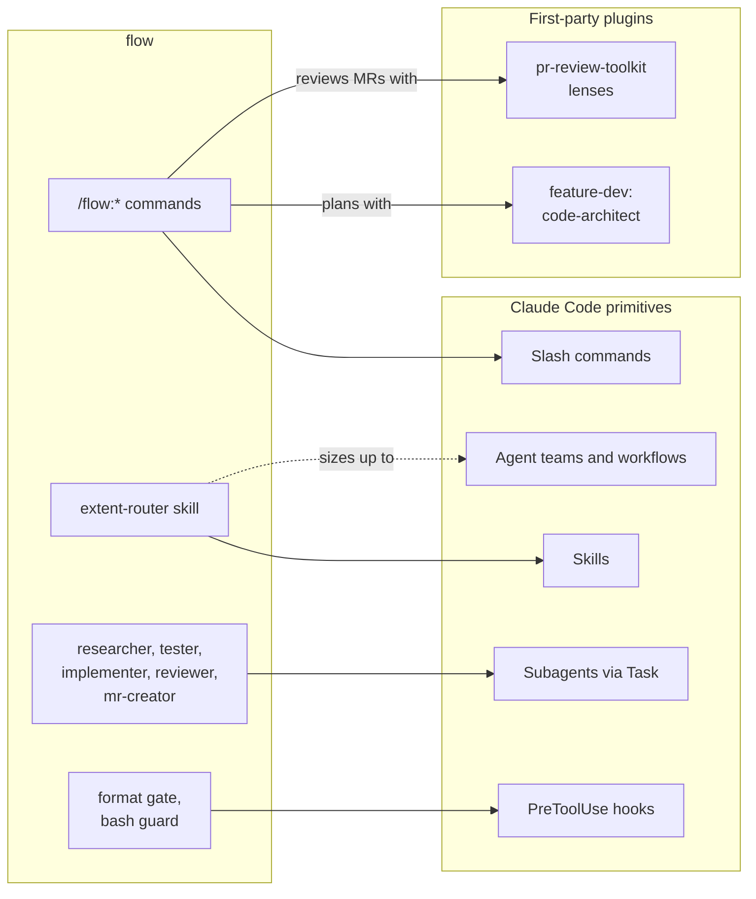
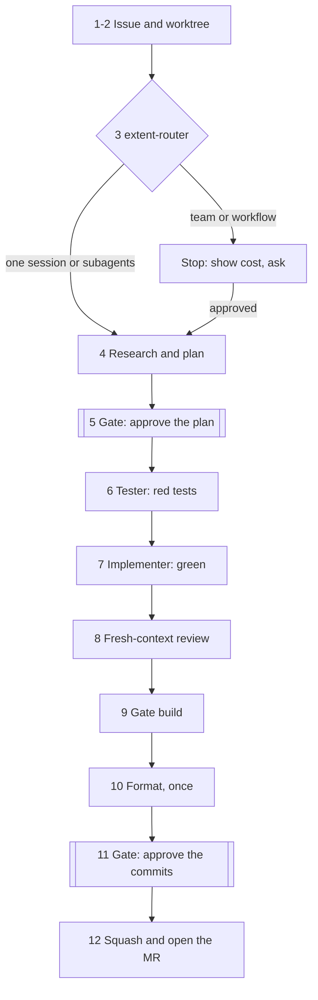

# flow

A Claude Code plugin that takes an issue to a merge request, and reviews other people's. Each issue
gets its own git worktree and a chain of agents (plan, red tests, implementation, fresh-context
review, build, format), with exactly two stops for you: approve the plan, approve the commits.
Reviews of other people's MRs post line-anchored **draft** comments that you prune and submit
yourself. Nothing in it is tied to a language, build system or forge: project conventions come from
your `CLAUDE.md`, and commands and preferences from one config file. GitLab (`glab`) and GitHub
(`gh`) are both supported.

## How it is built

flow adds no runtime of its own. Every part is a standard Claude Code primitive, and where a
first-party plugin already does a job well, flow calls it instead of reimplementing it.



## Commands

| Command | What it does |
| --- | --- |
| `/flow:start-issue <id>` | Worktree, plan, red tests, implementation, self-review, gate build, format, pushed commits, MR |
| `/flow:status` | Where this worktree stands: step, gate, branch, MR, pipeline |
| `/flow:review-queue` | The MRs waiting on your review; pick one to start it |
| `/flow:review-mr <id> [--hold]` | Fans out review lenses, filters hard, posts draft comments. `--hold` keeps them in `.flow-notes.json` instead, with a severity each, for a front end to show and post |
| `/flow:resolve-comments <id>` | Sorts the feedback on your MR, fixes what is real, lands one commit |
| `/flow:watch-pipeline [id]` | Polls CI, fixes real failures, retries known flakes, within hard limits |
| `/flow:vs <file>[:line]` | Optional, for Visual Studio users: opens the file at a line |

## The issue pipeline

`/flow:start-issue` runs twelve numbered steps. Only the two gates wait for you; everything between
them runs uninterrupted.



- **Plan.** Cheap `researcher` agents read the areas the issue touches in parallel; `code-architect`
  turns their briefs into `.flow-plan.md`: the issue, the fix, Mermaid UML, the files, the test list,
  mockups when there is a UI, and what done means.
- **Commits.** Before the second gate the branch is shaped into commits that read one at a time and
  pushed, so you can go through them before the MR exists. The MR step then squashes.
- **Progress.** Each step is written to `.flow-state.json` in the worktree as it starts (`active`),
  finishes (`done`), is skipped (`skipped`) or stops at a gate (`waiting`). A session that dies or is
  compacted resumes from it, and `/flow:status` and front ends read it.

## Agents

| Agent | Model | Job |
| --- | --- | --- |
| `researcher` | Sonnet | Reads one area and returns a factual brief. Read-only, launched several at once |
| `tester` | Opus | Writes the planned tests and makes sure they fail for the right reason. Never production code |
| `implementer` | Opus | Makes the red tests pass inside the plan's files. Never edits a test |
| `reviewer` | Opus | Reviews the diff in fresh context against `CLAUDE.md`. Reports, never edits |
| `mr-creator` | Opus | Squashes, pushes with lease, opens the MR from your template. Git only |

## Hooks

Two `PreToolUse` hooks on Bash:

- **Format gate** blocks `git commit` when source files changed after the formatter last ran. The
  format step stamps `$(git rev-parse --git-dir)/flow-formatted`.
- **Bash guard** blocks `git push --force` without a lease and, when `verify.formatGuard` names the
  project's tree-wide formatter, a run of it not acknowledged with `FLOW_TREEWIDE_OK=1`.

## The extent-router skill

`extent-router` picks the smallest arrangement that can do a job: one session, subagents, an agent
team, or a dynamic workflow. Each rung up multiplies token cost. `/flow:start-issue` invokes it at
step 3, and nothing else in flow does; Claude may also pick it up on its own when a task looks like
it needs parallel agents. At one session or subagents it proceeds silently. At a team or a workflow
it stops, says what it would run and roughly what it costs, and waits for you.

## Configuration

flow reads `.claude/flow.json` in the repository (shared with the team) and falls back to
`~/.claude/flow.local.json` (personal, never committed). Copy
[`flow.config.example.json`](flow.config.example.json) to either and fill it in.

| Key | Meaning |
| --- | --- |
| `forge` | `glab` or `gh` |
| `project`, `defaultTarget` | The repository path and the branch MRs target |
| `worktreeRoot`, `branchPattern` | Where worktrees go, and branch names such as `you/{issue}-{slug}` |
| `verify.syntaxCheck`, `verify.targeted` | The cheap inner loop: seconds per edit, one test target |
| `verify.gate` | Every full build that must pass before the commits gate |
| `verify.format` | The formatter, run once at the end |
| `verify.extra` | Further checks after formatting, each with its condition after a `#` |
| `verify.formatGuard` | Regex for a tree-wide formatter the bash guard should hold back |
| `review.floor`, `review.mute` | Confidence floor for findings, and topics never to comment on |
| `mr.template` | Markdown file for the MR description; unset gives Summary / How to test / Notes |
| `mr.assignee` | `"me"` (default) or `null` |
| `mr.reviewers` | `null` adds none (default), `"none"` also strips project defaults, or a list of usernames |
| `ci.*` | Poll interval, stall limit, attempts, jobs that cannot be verified locally, known flaky tests |

An MR template is plain Markdown. `{issue}` becomes the issue number, `<…>` slots are written by
the agent, and an HTML comment holds instructions for the agent that are left out of the MR.

## Install

Clone it where Claude Code picks up plugins:

```
git clone https://github.com/MarkusVGJensen/flow ~/.claude/skills/flow
```

Then create your config as above, and install the companion plugins from
`claude-plugins-official` (`/plugin install <name>@claude-plugins-official` in a session):

- **feature-dev**: `code-architect`, used for the plan
- **pr-review-toolkit**: the review lenses `/flow:review-mr` fans out to
- a language server plugin for your language (**clangd-lsp**, **pyright-lsp**, …), which saves more
  tokens than anything else: symbol lookups instead of repeated grep sweeps

For a desktop front end, with a tab per issue, the review queue, the step timeline and one-click
worktrees, see [Helm](https://github.com/MarkusVGJensen/helm-releases).

## Design choices worth keeping

- **Two gates.** You approve a plan, then the commits. If you remove one, remove the first.
- **Format once, last.** Formatting rewrites mtimes, which on a large project forces a full rebuild.
- **Keep the inner loop cheap.** Full builds belong in `verify.gate` and nowhere else.
- **Report what can happen.** A finding that guards a case no caller produces today is dropped, in
  self-review and in reviews of others alike.
- **The CI watcher's limits are absolute.** It pushes with lease, tags before every rewrite, refuses
  to rewrite an MR with open review comments, and stops after a fixed number of attempts.
