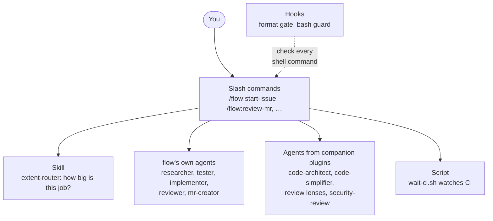
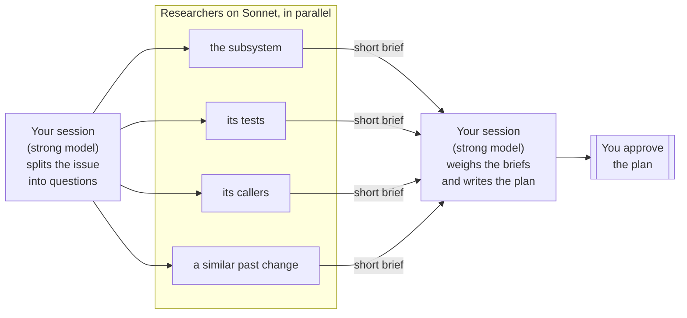
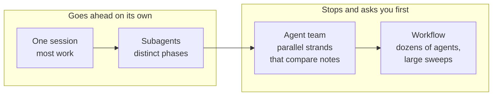
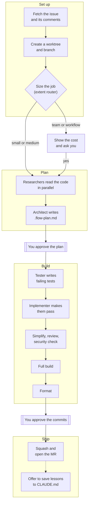
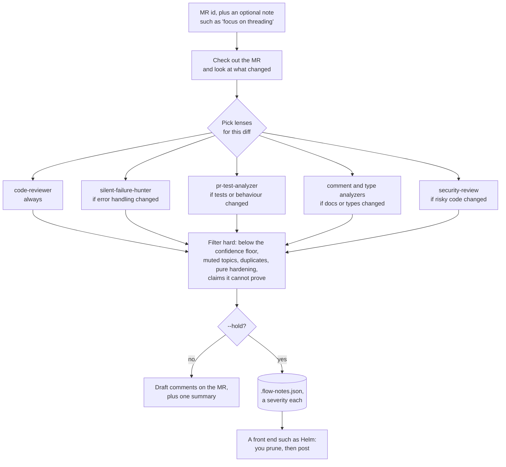

# flow

A Claude Code plugin that takes an issue all the way to a merge request, and helps you review other
people's. You give it an issue number; it creates a separate git worktree for that issue and runs a
chain of agents that plan, write tests, implement, review and format the change. It only stops twice
to ask you something: once to approve the plan, and once to approve the commits.

What flow adds to Claude Code:

- **One command from issue to MR.** `/flow:start-issue 128` fetches the issue, plans, writes failing
  tests, makes them pass, reviews the result and opens the merge request.
- **A worktree per issue.** Each issue is worked on in its own checkout, so several can run side by
  side and your main checkout is never touched.
- **Exactly two stops for you.** Approve the plan, then approve the commits. Everything in between
  runs without asking.
- **Test first.** One agent writes tests that fail, a different agent makes them pass and is not
  allowed to edit the tests.
- **A review in fresh context.** The change is reviewed by an agent that did not write it, plus a
  security review when the diff touches risky code.
- **Cheap research, careful decisions.** Reading the code is fanned out to several cheaper agents in
  parallel; the strong model only sees their short summaries and makes the decisions.
- **Reviews of other people's MRs** that post line-anchored **draft** comments. Nothing is published
  until you submit the review yourself.
- **CI watching that costs nothing while it waits.** A script polls the pipeline in the background and
  only wakes the model when there is a result.
- **Guard rails as hooks.** Commits are blocked until the code is formatted, and force pushes without
  a lease are blocked outright.
- **Resumable.** Progress is written to a file after every step, so a crashed or restarted session
  picks up where it left off.

flow is not tied to a language, build system or forge. Project conventions come from your
`CLAUDE.md`, and commands and preferences from one config file. GitLab (`glab`) and GitHub (`gh`) are
both supported.

## Contents

- [Quick start](#quick-start)
- **What is in flow**
  - [The parts of the plugin](#the-parts-of-the-plugin)
  - [Commands](#commands)
  - [Agents](#agents)
  - [Companion plugins](#companion-plugins)
- **The Claude Code features it uses**
  - [A short introduction](#a-short-introduction-to-the-claude-code-features)
  - [Where flow uses each one](#where-flow-uses-each-one)
- **The ideas behind it**
  - [Worktree per issue](#worktree-per-issue)
  - [Two gates](#two-gates)
  - [Fan-out research: cheap reading, careful thinking](#fan-out-research-cheap-reading-careful-thinking)
  - [Red tests, then green](#red-tests-then-green)
  - [Review in fresh context](#review-in-fresh-context)
  - [Sizing the job: the extent router](#sizing-the-job-the-extent-router)
  - [Hooks as guard rails](#hooks-as-guard-rails)
  - [Waiting without the model](#waiting-without-the-model)
  - [Progress you can resume from](#progress-you-can-resume-from)
- **How it runs**
  - [Working an issue, step by step](#working-an-issue-step-by-step)
  - [Reviewing other people's MRs](#reviewing-other-peoples-mrs)
  - [What it costs](#what-it-costs)
- **Using it**
  - [Configuration](#configuration)
  - [Recovering](#recovering)
  - [Testing the plugin](#testing-the-plugin)
  - [Design choices worth keeping](#design-choices-worth-keeping)

## Quick start

1. Clone the plugin where Claude Code picks up plugins, and copy the example config:

   ```
   git clone https://github.com/MarkusVGJensen/flow ~/.claude/skills/flow
   cp ~/.claude/skills/flow/flow.config.example.json ~/.claude/flow.local.json
   ```

2. Fill in the config. GitLab and GitHub differ only in the first two lines:

<table>
<tr><th>GitLab</th><th>GitHub</th></tr>
<tr><td>

```json
{
  "forge": "glab",
  "project": "group/repo",
  "defaultTarget": "main",
  "worktreeRoot": "~/worktrees",
  "branchPattern": "you/{issue}-{slug}"
}
```

</td><td>

```json
{
  "forge": "gh",
  "project": "owner/repo",
  "defaultTarget": "main",
  "worktreeRoot": "~/worktrees",
  "branchPattern": "you/{issue}-{slug}"
}
```

</td></tr>
</table>

3. Install the [companion plugins](#companion-plugins).
4. In a Claude Code session in your checkout, run `/flow:start-issue 128`.

For a desktop front end, with a tab per issue, the review queue, a step timeline and one-click
worktrees, see [Helm](https://github.com/MarkusVGJensen/helm-releases).

---

# What is in flow

## The parts of the plugin

flow has no runtime of its own. It is a set of plain Claude Code building blocks: Markdown files for
the commands, agents and skill, two small shell hooks, and one shell script. Where a first-party
plugin already does a job well, flow calls it instead of reimplementing it.



| Part | Files | What it is for |
| --- | --- | --- |
| Commands | `commands/*.md` | The entry points you type, such as `/flow:start-issue`. Each one is a recipe the session follows |
| Agents | `agents/*.md` | Specialised helpers the commands hand work to, each with only the tools its job needs |
| Skill | `skills/extent-router/` | Decides how much machinery a task deserves before any is spent |
| Hooks | `hooks/` | Checks that run before every shell command and can block it |
| Script | `scripts/wait-ci.sh` | Waits on CI in the background so the model does not have to |
| Evals | `evals/` | Tests for the plugin's own behaviour |

## Commands

| Command | What it does |
| --- | --- |
| `/flow:start-issue <id>` | Takes an issue from nothing to an open MR: worktree, plan, tests, implementation, review, build, format, commits, MR |
| `/flow:status` | Shows where the current worktree stands: step, gate, branch, MR and pipeline |
| `/flow:review-queue` | Lists the MRs waiting on your review; pick one to start reviewing it |
| `/flow:review-mr <id> [--hold]` | Reviews someone else's MR and posts draft comments. With `--hold` the findings are saved to `.flow-notes.json` instead, each with a severity, for a front end to show and post |
| `/flow:resolve-comments <id>` | Sorts the review feedback on your own MR, fixes what is real, and lands it as one commit |
| `/flow:watch-pipeline [id]` | Waits on CI without spending tokens, fixes real failures and retries known flaky tests, within hard limits |
| `/flow:vs <file>[:line]` | Optional, for Visual Studio users: opens a file at a line |

## Agents

| Agent | Default model | Tools | Job |
| --- | --- | --- | --- |
| `researcher` | Sonnet | read, LSP | Reads one area of the code and returns a short factual brief. Several run at once |
| `tester` | Opus | edit, LSP | Writes the planned tests and checks they fail for the right reason. Never touches production code |
| `implementer` | Opus | edit, LSP | Makes the failing tests pass, inside the files the plan names. Never edits a test |
| `reviewer` | Opus | read, LSP | Reviews the diff against `CLAUDE.md` without having seen it being written. Reports, never edits |
| `mr-creator` | Opus | git only | Squashes the commits, pushes, and opens the MR from your template |

## Companion plugins

flow leans on these first-party plugins from `claude-plugins-official`. Install each with
`/plugin install <name>@claude-plugins-official` in a session:

- **feature-dev**: its `code-architect` agent writes the plan.
- **pr-review-toolkit**: the review "lenses" `/flow:review-mr` runs in parallel.
- **code-simplifier**: the first self-review pass.
- **claude-md-management**: folds lessons from an issue into `CLAUDE.md`.
- **A language server plugin** for your language (`clangd-lsp`, `pyright-lsp`, …). The agents use it
  to look up symbols directly instead of searching the whole tree with grep.

`security-review` is built into Claude Code and needs no install.

---

# The Claude Code features it uses

## A short introduction to the Claude Code features

If you already know Claude Code's extension points, skip to [the table](#where-flow-uses-each-one).

- **Slash commands.** A Markdown file of instructions that runs when you type `/name`. Plugin commands
  are namespaced, hence `/flow:start-issue`.
- **Skills.** Instructions Claude loads when a task matches their description, or when a command asks
  for them by name.
- **Subagents.** Separate Claude instances started for one job. Each gets its own context window, its
  own tool list and, if wanted, its own model. Only its final answer comes back to your session, so
  whatever it read does not crowd your context.
- **Parallel fan-out.** Starting several subagents at once, so independent work finishes in about
  the time of the slowest one.
- **Model per call.** Every subagent call can name the model it runs on, so cheap work can go to a
  cheaper model.
- **Hooks.** Shell commands Claude Code runs at fixed moments. A `PreToolUse` hook runs before a tool
  call and can block it, which makes it a reliable guard rail: it applies whatever the model intended.
- **The `LSP` tool.** Lets an agent ask an installed language server for definitions and references,
  answering "who calls this?" in one call.
- **Background Bash.** A shell command that keeps running while the model is idle, and wakes the
  session when it prints or exits.
- **Agent teams and workflows.** Ways to run many agents together: teams that share results, and
  workflow scripts that orchestrate dozens of agents. Powerful, but every agent costs tokens.
- **Plugins and plugin evals.** A plugin bundles all of the above in one folder. Plugin evals are
  test cases that run Claude with and without the plugin and grade the difference.

## Where flow uses each one

| Feature | Where flow uses it |
| --- | --- |
| Slash commands | The seven [`/flow:*` commands](#commands) |
| Skills | `extent-router` (invoked by `start-issue`, and picked up by Claude on its own), the built-in `security-review`, and `claude-md-management:revise-claude-md` |
| Subagents | flow's five [agents](#agents), plus `code-architect`, `code-simplifier` and the `pr-review-toolkit` lenses |
| Parallel fan-out | Researchers during planning; review lenses in `review-mr` |
| Model per call | `models` in the config picks the model for each kind of agent |
| Hooks | Two `PreToolUse` hooks on Bash: the [format gate and the bash guard](#hooks-as-guard-rails) |
| `LSP` tool | Researcher, tester, implementer and reviewer, when a language server is installed |
| Background Bash | `wait-ci.sh`, while [watching CI](#waiting-without-the-model) |
| Agent teams, workflows | The top two rungs of the [extent router](#sizing-the-job-the-extent-router), used only after you approve the cost |
| Plugin evals | `evals/`; see [testing the plugin](#testing-the-plugin) |

---

# The ideas behind it

## Worktree per issue

Every issue gets its own `git worktree` under `worktreeRoot`, on a new branch named from
`branchPattern`. All building and editing happens there, never in the directory you started from.
That keeps your main checkout clean and lets several issues run at the same time in different
sessions.

## Two gates

flow stops for you exactly twice:

1. **The plan.** Before any code is written you read `.flow-plan.md`: what is wrong, the fix and the
   alternatives, UML diagrams, the files that change, the tests to write, mockups when there is a UI,
   and what "done" means. Say yes, or say what to change.
2. **The commits.** Before the MR exists, the work is shaped into commits that read well one at a
   time, and pushed, so you can go through them.

Between the gates nothing asks for permission. If you ever remove a gate, remove the first one.

## Fan-out research: cheap reading, careful thinking

Most of the tokens in planning go into reading code, and reading needs little judgement. So planning
is shaped like a sandwich: the strong model at both ends, a cheaper one in the middle.



1. Your session, on whatever model you run Claude Code with, decides what needs reading and writes one
   question per area.
2. Several `researcher` agents on Sonnet read in parallel. Each answers with a page-long factual
   brief.
3. The briefs go back to your session, which has `code-architect` draft the plan from the issue and
   the briefs, reads the draft, and owns what you are shown.

What that buys:

- **Cost.** The bulk reading runs on the cheaper model. A brief is a page; the files behind it are
  thousands of lines.
- **Context.** The session running the issue sees findings, not raw files, so its context stays small
  for the rest of the work.
- **Time.** Four researchers reading at once finish in about the time of one.
- **Precision.** With a language server installed, "who calls this?" is one `LSP` call, not a grep
  sweep.

A one-file fix gets no researchers at all: the session just reads the code itself. Every model is a
setting under `models` in the config, so trading cost for depth is a config change.

## Red tests, then green

The plan contains a test list, one line per behaviour. The `tester` writes exactly those tests and
checks that they fail because the behaviour is missing, not because they do not compile. The
`implementer` then makes them pass and is not allowed to touch the tests, so it cannot make a test
pass by weakening it. If they go back and forth more than three times, flow stops: the plan is
probably wrong.

## Review in fresh context

An agent that wrote the code is a poor judge of it. After the tests pass, the diff gets three passes:

1. **Simplify.** `code-simplifier` tidies the production files without changing behaviour; the tests
   re-run to prove it.
2. **Review.** `flow:reviewer`, which never saw the code being written, checks the diff against
   `CLAUDE.md`. Real findings go back to the implementer.
3. **Security, when it applies.** The built-in `security-review` skill runs when the diff touches
   input parsing, auth, file paths, shell or SQL built from data, deserialization, secrets or
   networking.

## Sizing the job: the extent router

Bigger machinery is not better machinery; each step up multiplies the token cost. The
`extent-router` skill picks the smallest arrangement that can do the job:



For one session or subagents it goes ahead without comment. For a team or a workflow it stops, says
what it would run and roughly what that costs, and waits for your yes. `/flow:start-issue` runs it
before planning; Claude may also pick it up on its own when a task looks like it needs many agents.

## Hooks as guard rails

Some rules are too important to leave to the model remembering them, so they are `PreToolUse` hooks
on Bash that run before every shell command:

- **Format gate.** Blocks `git commit` when source files changed after the formatter last ran. The
  format step leaves a stamp file, `$(git rev-parse --git-dir)/flow-formatted`, that the hook checks.
- **Bash guard.** Blocks `git push --force` without `--force-with-lease`. When `verify.formatGuard`
  names the project's tree-wide formatter, it also blocks running it over the whole tree unless the
  command is acknowledged with `FLOW_TREEWIDE_OK=1`.

## Waiting without the model

A model that polls CI pays for every check. `/flow:watch-pipeline` instead starts
`scripts/wait-ci.sh` in the background. The script asks `glab` or `gh` every `ci.pollMinutes`,
prints a line when the status changes, and exits when CI finishes. The session only wakes for a
result: green, a failure to triage, or a 25-minute mark to restart the waiter.

A real failure gets a backup tag, a fix verified locally where possible, and a push with lease, at
most `ci.attempts` times. A known flaky test is retried instead.

## Progress you can resume from

Each step of `start-issue` is written to `.flow-state.json` in the worktree as it starts (`active`),
finishes (`done`), is skipped (`skipped`) or stops at a gate (`waiting`). Run `/flow:start-issue` again
after a crash, a context compaction or a night's sleep, and it continues from there. `/flow:status`
and front ends such as Helm read the same file.

---

# How it runs

## Working an issue, step by step

`/flow:start-issue` runs twelve steps in four phases. Only the two gates wait for you.



The step numbers are what `.flow-state.json` and `/flow:status` report:

| Phase | Step | What happens |
| --- | --- | --- |
| Set up | 1 `issue` | Read the config and fetch the issue, including its comments |
| | 2 `worktree` | Create the worktree and branch, or resume one that exists |
| | 3 `extent` | The extent router sizes the job; a team or workflow needs your yes |
| Plan | 4 `plan` | Researchers read in parallel, the architect writes `.flow-plan.md` |
| | 5 `plan-gate` | **You approve the plan** |
| Build | 6 `tester` | Failing tests from the plan's test list (skipped if the list is empty) |
| | 7 `implementer` | Code that makes them pass; cheap checks between edits |
| | 8 `review` | Simplify, fresh-context review, security review when it applies |
| | 9 `gate-build` | Every command in `verify.gate` must pass |
| | 10 `format` | The formatter, once, then `verify.extra` checks |
| Ship | 11 `commits-gate` | Commits are shaped and pushed; **you approve them** |
| | 12 `mr` | `mr-creator` squashes and opens the MR, then flow offers to save lessons |

**Lessons.** Once the MR is open, flow offers to fold what the issue taught (a convention the
reviewer had to enforce, a build quirk) into `CLAUDE.md` through `claude-md-management`. Only on a
yes, and you see the change first. `"learn": "off"` turns the offer off.

## Reviewing other people's MRs

`/flow:review-mr` sizes the review to the diff, runs the review lenses in parallel, and throws away
most of what they find before you see any of it.



- **Only as wide as needed.** A one-file fix gets `code-reviewer` alone. Your note outranks the
  defaults: "focus on the threading" runs only the lenses that bear on threading.
- **Drafts only.** Nothing is submitted. The comments stay yours to prune until you submit the review.

## What it costs

Where the tokens of one issue go, cheapest first. The model column is the default; `models` in the
config changes it.

| Step | Who | Model | What drives the cost |
| --- | --- | --- | --- |
| Set up (1-3) | your session | yours | The issue and its comments |
| Research (4) | `researcher` ×0 to N | Sonnet | Reading: most of the planning tokens, on the cheap model |
| Plan (4) | `code-architect`, your session | plugin's, yours | The briefs, not the files |
| Tests and code (6-7) | `tester`, `implementer` | Opus | Edits and test runs; `verify.syntaxCheck` keeps the loop cheap |
| Self-review (8) | `code-simplifier`, `reviewer`, `security-review` | plugin's, Opus, yours | One read of the diff each; security only on risky diffs |
| Build and format (9-10) | your session | yours | Command output, once each |
| Commits and MR (11-12) | your session, `mr-creator` | yours, Opus | Small |
| CI | `wait-ci.sh` | none | Nothing while CI runs |
| Team or workflow | many | per agent | Only after you approve the estimate |

---

# Using it

## Configuration

flow reads `.claude/flow.json` in the repository (shared with the team) and falls back to
`~/.claude/flow.local.json` (personal, never committed). Copy
[`flow.config.example.json`](flow.config.example.json) to either and fill it in. Without a config,
`/flow:start-issue` stops and tells you which file to create; it never guesses a project or a command.

**Repository**

| Key | Meaning |
| --- | --- |
| `forge` | `glab` or `gh` |
| `project`, `defaultTarget` | The repository path, and the branch MRs target |
| `worktreeRoot`, `branchPattern` | Where worktrees go, and how branches are named, such as `you/{issue}-{slug}` |

**Building and checking**

| Key | Meaning |
| --- | --- |
| `verify.syntaxCheck`, `verify.targeted` | The cheap inner loop: seconds per edit, and one test target |
| `verify.gate` | Every full build that must pass before the commits gate |
| `verify.format` | The formatter, run once at the end |
| `verify.extra` | Further checks after formatting, each with its condition after a `#` |
| `verify.formatGuard` | Regex for a tree-wide formatter the bash guard should hold back |

**Reviews, models and lessons**

| Key | Meaning |
| --- | --- |
| `review.floor`, `review.mute` | Confidence floor for findings, and topics never to comment on |
| `models.research`, `.architect`, `.build`, `.review`, `.lenses`, `.mr` | The model for each kind of agent; `null` keeps the agent's own |
| `learn` | `"ask"` (default) offers to save lessons to `CLAUDE.md` after the MR; `"off"` never does |

**Merge requests and CI**

| Key | Meaning |
| --- | --- |
| `mr.template` | Markdown file for the MR description; unset gives Summary / How to test / Notes |
| `mr.assignee` | `"me"` (default) or `null` |
| `mr.reviewers` | `null` adds none (default), `"none"` also strips project defaults, or a list of usernames |
| `ci.*` | Poll interval, stall limit, attempts, jobs that cannot be verified locally, known flaky tests |

An MR template is plain Markdown: `{issue}` becomes the issue number, `<…>` slots are filled in by
the agent, and an HTML comment holds instructions for the agent that are left out of the MR.

## Recovering

- **A session died, was compacted, or you came back tomorrow.** Run `/flow:start-issue <id>` again in
  your checkout. It finds the worktree's `.flow-state.json` and resumes: finished and skipped steps
  are not redone, an interrupted step is finished, and a waiting gate shows you the plan or the
  commits again.
- **Where am I?** `/flow:status`.
- **The format gate blocked a commit.** Files changed after the formatter ran. Run `verify.format`
  again, then `touch "$(git rev-parse --git-dir)/flow-formatted"`.
- **A CI fix went wrong.** Every rewrite is preceded by a `backup/<branch>-<stamp>` tag. Reset to it
  and push with `--force-with-lease`.
- **The plan turns out wrong after the gate.** Say so. The architect re-plans and rewrites
  `.flow-plan.md`; a plan nobody believes in is not patched.

## Testing the plugin

`evals/` holds [plugin evals](https://code.claude.com/docs/en/plugin-evals): small cases that run in
a clean sandbox with and without flow loaded, so each one shows what flow changes.

| Case | Checks that |
| --- | --- |
| `extent-router-small` | A one-line fix stays in one session, and the skill fires |
| `extent-router-large` | A many-package migration stops and states the agents and cost before spending |
| `start-issue-needs-config` | Without a config, it names the file to create and invents nothing |

```
claude plugin eval . --runs 3 --max-cost-usd 5
```

Add a case whenever a command's behaviour is changed on purpose, so the next change cannot quietly
undo it. `claude plugin validate .` checks the plugin's structure.

## Design choices worth keeping

- **Two gates.** You approve a plan, then the commits. If you remove one, remove the first.
- **Cheap reading, careful thinking.** Bulk reading on the cheap model, judgement on the strong one.
- **Format once, last.** Formatting rewrites file timestamps, which on a large project forces a full
  rebuild.
- **Keep the inner loop cheap.** Full builds belong in `verify.gate` and nowhere else.
- **Never wait with the model.** Anything that only waits (CI, a long build) runs as a script.
- **Report what can happen.** A finding that guards against a case no caller produces today is
  dropped, in self-review and in reviews of others alike.
- **The CI watcher's limits are absolute.** It pushes with lease, tags before every rewrite, refuses
  to rewrite an MR with open review comments, and stops after a fixed number of attempts.
